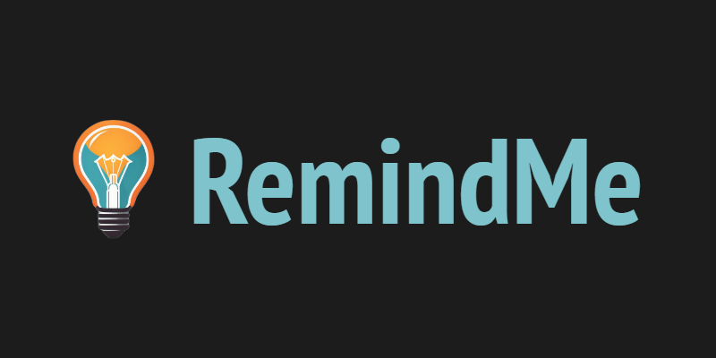

# RemindMe



## Description
Hi there 👋! You can think of [RemindMe](https://remindme-l.vercel.app/landing) as your personal E-Wall, where you can have your inspirations, ‘Why’s, favorite useful quotes, and even reminders for tough times. Refresh these in your mind every day, Finally, you can also make them public, see others’ reflections on yours, and vice versa

Find the App here [RemindMe](https://remindme-l.vercel.app/landing)

### Why RemindMe?
**Did you know** that our brains have the capacity to store over 2.5 petabytes of information? That’s like having 2.5 million gigabytes of data at our disposal. However, much like computers, we have a limited working memory—our RAM, if you will. We can only hold so much information on the surface at one time. New information often overrides the old, pushing important thoughts, facts, and motivations to the background.


Now, I have a question for you... How many times have you thought, ‘If only I remembered that quote, fact, or piece of advice, my day would have been better’? Maybe you would have handled a situation more effectively, felt more motivated, or simply lived a more productive day. We’ve all been there, wishing we had something to remind us of the wisdom or motivations we’ve encountered in life. That’s where RemindMe comes in.


<!-- In the world of many troubles, distractions and stuff, maintaining an upbeat spirit is priceless. RemindMe is inspired by the need to have all our favourite sayings in one place, which serves as a source of inspiration and motivation to remain focused and productive throughout the day. RemindMe aims to literally remind users of all the things - WHY?s, quotes, pictures, events, memories - that mean so much to them and which elate their spirit in one place. These are called 'reminders'.

RemindMe is a user-friendly web application designed to help users manage their 'reminders' efficiently. It provides features such as user authentication, reminder creation, updating, deletion, and profile management with image uploads. -->

## Table of Contents

- [Features](#features)
- [Installation](#installation)
- [Usage](#usage)
- [API Endpoints](#api-endpoints)
- [Technologies](#technologies)
- [Contributing](#contributing)
- [License](#license)
- [Contact](#contact)

## Features

- **User Authentication**: Secure user registration, login, and profile management.
- **Reminder Management**: Create, update, view, and delete reminders.
- **Profile Management**: Update profile information and upload profile pictures.
- **Responsive Design**: Accessible on both web and mobile devices.

## Installation

### Prerequisites

Make sure you have these installed before proceeding to next steps:

- Python 3.x
- MySQL

### Steps

1. **Clone the Repository:**
   ```bash
   git clone https://github.com/loayalsaid1/RemindMe.git
   cd RemindMe
   ```
2. Set Up Virtual Environment
   ```
   python3 -m venv venv
   source venv/bin/activate
   ```
3. Install the Dependencies
   ```
   pip install -r ./config/requirements.txt
   ```
4. Launch MySQL And Set Up The Following:
    ```
    CREATE DATABASE IF NOT EXISTS remind_me_dev_db;
    CREATE USER IF NOT EXISTS 'remind_me_dev'@'localhost' IDENTIFIED BY 'Remind_me_dev_pwd1';
    GRANT ALL PRIVILEGES ON `remind_me_dev_db`.* TO 'remind_me_dev'@'localhost';
    GRANT SELECT ON `performance_schema`.* TO 'remind_me_dev'@'localhost';
    FLUSH PRIVILEGES;
    ```
5. Run the Application
    ```
    ./config/run_servers.sh
    ```


## Usage
### Access the Application

`Open your web browser and navigate to http://localhost:5000 to access the RemindMe application.
`

### User Registration and Login
* Register: Create a new account using the registration form.
* Login: Access your account using your email and password.

### Reminder Management
- Create Reminder: Add new reminders with descriptions and optional tags.
- View Reminders: View a list of your reminders.
- Update Reminder: Edit the details of an existing reminder.
- Delete Reminder: Remove reminders that are no longer needed.

### Profile Management
- Update Profile: Modify your username, gender, and description.
- Upload Profile Picture: Add or change your profile picture using ImageKit.

## API Endpoints
### Authentication
1. Register: POST /api/v1/auth/register
2. Login: POST /api/v1/auth/login

### Users
1. Get All Users: GET /api/v1/users
2. Get User by ID: GET /api/v1/users/:id

### Reminders
1. Create Reminder: POST /api/v1/reminders
2. Get All Reminders: GET /api/v1/reminders
3. Get Reminders by User: GET /api/v1/users/:user_id/reminders
4. Get Reminder: GET /api/v1/reminders/:id
5. Update Reminder: PUT /api/v1/reminders/:id
6. Delete Reminder: DELETE /api/v1/reminders/:id

### Reflections
1. Create Reflection: POST /api/v1/reminders/:id/reflections
2. Get Reflections: GET /api/v1/reminders/:id/reflections
3. Update Reflection: PUT /api/v1/reflections/:id
4. Delete Reflection: DELETE /api/v1/reflections/:id

### Streaks
1. Get Streaks: GET /api/v1/streaks
2. Get Streak: GET /api/v1/streaks/:id

### Profile
1. Update Profile: PUT /api/v1/profile
2. Upload Profile Picture: POST /api/v1/profile/upload

<!-- ## Technologies
1. Backend: Flask, Flask-Login, Flask-JWT, SQLAlchemy
2. Frontend: HTML, CSS, JavaScript
3. Database: MySQL
4. Image Handling: ImageKit
5. Deployment: Docker, Gunicorn, Nginx -->


## Contributing
Contributions from the community are welcome. You might want to contact us first to discus desired features.
1. Fork the repository.
2. Create your feature branch: `git checkout -b feature/your-feature-name`
3. Commit your changes: `git commit -m 'Add some feature'`
4. Push to the branch: `git push origin feature/your-feature-name`
5. Open a pull request.

## License

This project is licensed under the MIT License - see the [LICENSE](LICENSE) file for details.

## Contact

For inquiries, reach out to us:
1. ### Loay Al-Said [GitHub](https://github.com/loayalsaid1)/[Twitter](https://x.com/LoayAlsaid1)/[LinkedIn](https://www.linkedin.com/in/loay-alsaid/)

2. ### Iygeal Anozie [GitHub](https://github.com/iygeal)/[Twitter](https://x.com/iygeal)/[LinkedIn](https://www.linkedin.com/in/iygeal/)
